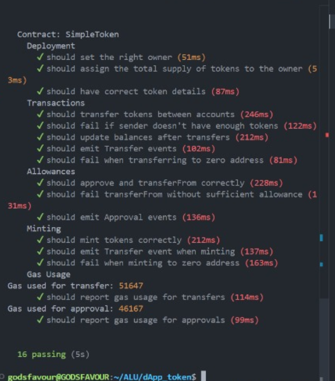
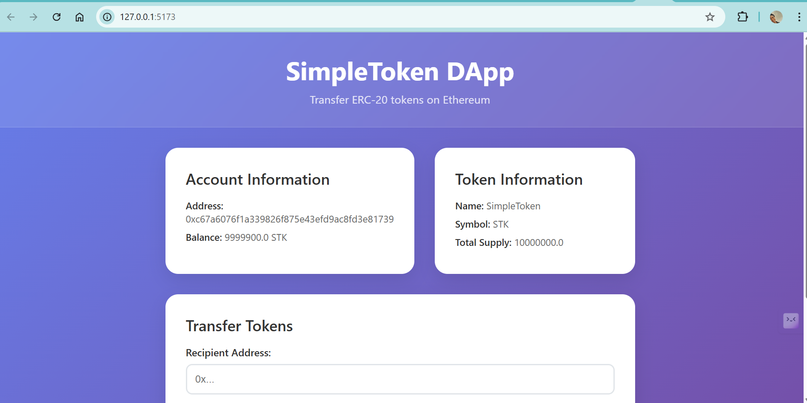

# SimpleToken DApp

A decentralized application (DApp) that allows users to transfer ERC-20 tokens on the Ethereum blockchain. Built with Solidity, Truffle, and React. [View deployment on etherscan](https://sepolia.etherscan.io/address/0x229581fc898bf0Ce3e26a8018a1B33e0e8B2C340#code) and [Live App](https://simple-token-dapp-ni5g.onrender.com/)

## Features

- **ERC-20 Token Contract**: Custom token with transfer, approval, and minting functionality
- **Web3 Integration**: Connect with MetaMask wallet
- **Token Transfers**: Send tokens between Ethereum addresses
- **Balance Checking**: View token balances in real-time
- **Transaction Tracking**: View transaction hashes on Etherscan

## Technology Stack

- **Smart Contract**: Solidity ^0.8.19
- **Development Framework**: Truffle Suite
- **Frontend**: React 18 with Vite
- **Web3 Library**: Ethers.js v6
- **Styling**: Vanilla CSS (no frameworks)
- **Testing**: Truffle + Chai + Mocha

## Project Structure

```
simple-token-dapp/
├── contracts/
│   ├── SimpleToken.sol
│   └── Migrations.sol
├── migrations/
│   ├── 1_initial_migration.js
│   └── 2_deploy_contracts.js
├── test/
│   └── SimpleToken.test.js
├── frontend/
│   ├── src/
│   │   ├── App.jsx
│   │   ├── App.css
│   │   └── main.jsx
│   └── package.json
├── truffle-config.js
├── package.json
└── README.md
```

## Prerequisites

- Node.js (v16 or higher)
- npm or yarn
- Truffle Suite (`npm install -g truffle`)
- Ganache CLI or Ganache GUI (for local development)
- MetaMask browser extension
- Ethereum testnet ETH (for gas fees)

## Setup Instructions

### 1. Install Truffle Globally

```bash
npm install -g truffle
```

### 2. Clone and Install Dependencies

```bash
git clone https://github.com/GChukwudi/simple-token-dapp.git
cd simple-token-dapp
npm install
```

### 3. Environment Configuration

Create a `.env` file in the root directory:

```bash
cp .env.example .env
```

Edit `.env` with your actual values:
- Get Infura project ID from [Infura.io](https://infura.io/)
- Export private key from MetaMask (WITHOUT 0x prefix for Truffle!)
- Get Etherscan API key from [Etherscan.io](https://etherscan.io/)

### 4. Compile Smart Contracts
```bash
ganache
```

```bash
truffle compile
```

### 5. Run Tests

```bash
truffle test
```

Expected output:



### 6. Deploy to Sepolia Testnet

```bash
truffle migrate --network sepolia
```

Save the deployed contract address from the output for frontend configuration.

### 7. Verify Contract (Optional)

```bash
truffle run verify SimpleToken --network sepolia
```

### 8. Setup Frontend

Navigate to the frontend directory and install dependencies:

```bash
cd frontend
npm install
```

Update the `CONTRACT_ADDRESS` in `src/App.jsx` with your deployed contract address.

### 9. Run Frontend

```bash
npm run dev
```

The application will be available at `http://localhost:5173`

## Local Development with Ganache

### 1. Install and Start Ganache

```bash
npm install -g ganache-cli
ganache-cli
```

Or use Ganache GUI from [Truffle Suite](https://trufflesuite.com/ganache/)

### 2. Deploy to Local Network

```bash
truffle migrate --network development
```

### 3. Connect MetaMask to Local Network

- Network: Localhost 7545
- Chain ID: 1337
- Currency: ETH

## Smart Contract Functions

### Core ERC-20 Functions

- `transfer(address _to, uint256 _value)`: Transfer tokens to another address
- `balanceOf(address _owner)`: Get token balance of an address
- `approve(address _spender, uint256 _value)`: Approve another address to spend tokens
- `transferFrom(address _from, address _to, uint256 _value)`: Transfer tokens on behalf of another address

### Additional Functions

- `mint(address _to, uint256 _value)`: Create new tokens (for testing)
- `name()`: Get token name
- `symbol()`: Get token symbol
- `decimals()`: Get token decimals
- `totalSupply()`: Get total token supply

## Using the DApp

### 1. Connect Wallet

- Click "Connect Wallet" button
- Approve MetaMask connection
- Ensure you're on Sepolia testnet

### 2. View Account Information

- Your address will be displayed
- Current token balance will show
- Token information (name, symbol, total supply) will load


### 3. Transfer Tokens

- Enter recipient address
- Enter amount to transfer
- Click "Transfer" button
- Confirm transaction in MetaMask
- Wait for confirmation

### 5. View Transaction

- Transaction hash will appear after successful transaction
- Click "View on Etherscan" to see transaction details

## Truffle Commands

### Development Commands

```bash
ganache

# Compile contracts
truffle compile

# Run tests
truffle test

# Deploy to development network
truffle migrate --network development

# Deploy to Sepolia
truffle migrate --network sepolia

# Reset and redeploy
truffle migrate --reset --network sepolia

# Open Truffle console
truffle console --network sepolia

# Verify contract on Etherscan
truffle run verify SimpleToken --network sepolia
```

### Truffle Console Examples

```javascript
// Get deployed contract instance
let instance = await SimpleToken.deployed()

// Check token details
await instance.name()
await instance.symbol()
await instance.totalSupply()

// Check balance
await instance.balanceOf("0x...")

// Transfer tokens
await instance.transfer("0x...", web3.utils.toWei("100", "ether"))
```

## Testing the DApp

### Local Testing with Ganache

1. Start Ganache:
```bash
ganache-cli
```

2. Deploy to local network:
```bash
truffle migrate --network development
```

3. Connect MetaMask to local network:
   - Network: Localhost 7545
   - Chain ID: 1337
   - Currency: ETH

### Testnet Testing

1. Get Sepolia ETH from faucets:
   - [Sepolia Faucet](https://sepoliafaucet.com/)
   - [Alchemy Faucet](https://sepoliafaucet.com/)

2. Deploy to Sepolia and test all functions

## Security Considerations

- Never commit private keys to version control
- Use testnet for development and testing
- Implement proper access controls for production
- Consider using OpenZeppelin contracts for production deployments
- Always test thoroughly before mainnet deployment

## Troubleshooting

### Common Issues

1. **Truffle compilation errors**
   - Check Solidity version in truffle-config.js
   - Ensure contracts are in the contracts/ directory

2. **Migration fails**
   - Check network configuration in truffle-config.js
   - Verify you have enough ETH for gas fees
   - Ensure private key is correct (without 0x prefix)

3. **MetaMask not connecting**
   - Ensure MetaMask is installed and unlocked
   - Check network selection (Sepolia testnet)
   - Refresh page and try again

4. **Transaction failing**
   - Check gas prices and limits
   - Ensure sufficient ETH for gas fees
   - Verify contract address is correct

### Error Messages

- "Insufficient balance": Not enough tokens to transfer
- "Cannot transfer to zero address": Invalid recipient address
- "Insufficient allowance": Approval required for transferFrom
- "Network not defined": Check truffle-config.js network configuration

## Additional Resources

- [Truffle Suite Documentation](https://trufflesuite.com/docs/)
- [Ethers.js Documentation](https://docs.ethers.io/)
- [OpenZeppelin Contracts](https://docs.openzeppelin.com/contracts/)
- [MetaMask Developer Docs](https://docs.metamask.io/)
- [Sepolia Testnet](https://sepolia.dev/)
- [Ganache Documentation](https://trufflesuite.com/ganache/)
